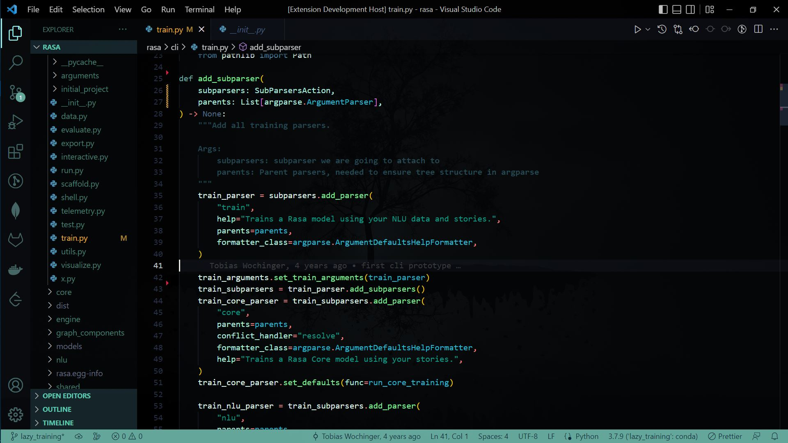

# [Tarek Dark](https://marketplace.visualstudio.com/items?itemName=LiuYuweiTarek.tarek-dark) 

This is the VS Code theme that I often use for work when I need to focus. It also supports semantic highlighting in Python, which is perfect for my job since I work with Python.

This theme is based on [Azure Contrast(Rainglow)](https://github.com/rainglow/vscode/blob/master/themes/azure-contrast.json), modified and developed through continuous experimentation with [VS Code Theme Editor](https://themes.vscode.one/) and [Color Hunt](https://colorhunt.co/). If you also enjoy this style, please feel free to give it a star and fork it to create your own unique theme!

P.S. You can use [VScode Extension: GlassIt-VSC](https://marketplace.visualstudio.com/items?itemName=s-nlf-fh.glassit) to achieve an even better effect!

Will be maintaining this as I have time, thanks for your understanding! 🙏🏽
## Screenshots

## For more information

* [How to make your own VS Code theme!](https://youtu.be/pGzssFNtWXw)
* [Semantic Highlight Guide](https://code.visualstudio.com/api/language-extensions/semantic-highlight-guide)

**Enjoy!**
